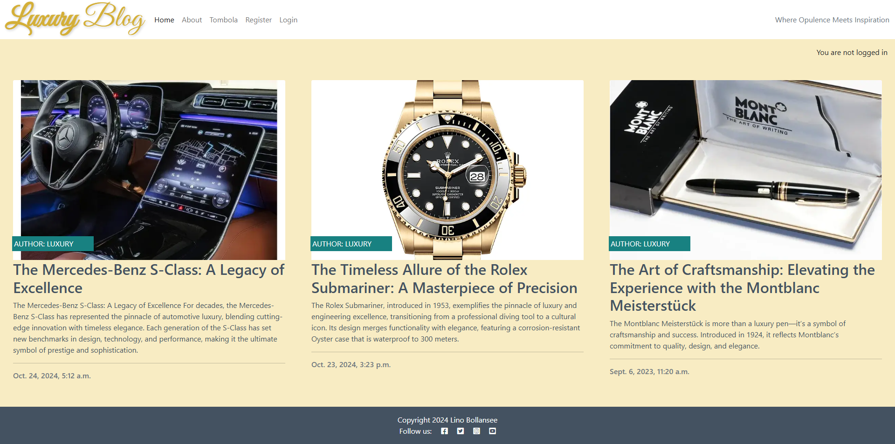

# The Luxury Blog
Portfolio Project 4: Full-Stack Toolkit - Code Institute

**Disclaimer: This fictional project is intended solely for educational purposes and is not suitable for practical real-world usage other than academic assessment.**

View the deployed site at [https://the-luxury-blog.onrender.com/](https://the-luxury-blog.onrender.com/)

Important: Please note that Render.com has a feature that automatically pauses services when they are not in active use. As a result, it may take about a minute for the site to load.

Luxury Blog web application preview screenshot:

## Agile Methodology

This project was planned using Agile project management through Epics, Descriptions, User Stories, Story Points, MoSCoW prioritization, Acceptance Criteria, and Tasks.

A Kanban board has been set up and used for this purpose, providing an organized overview. It can be accessed at: [https://github.com/users/linobollansee/projects/6](https://github.com/users/linobollansee/projects/6)

A screenshot of The Luxury Blog Kanban Board during active development phase usage:

### Epics

Epic 1: Plan and Design the Full-Stack Web Application using an MVC Framework
- Description: This epic focuses on planning and designing the Full-Stack application, ensuring adherence to Agile methodology, UX principles, and accessible design.
  - User Stories:
    - User Story 1.1: Design Front-End for a Data-Driven Web Application
    - User Story 1.2: Plan Agile Development Using an Agile Tool
    - User Story 1.3: Ensure Code Quality Standards

Epic 2: Implement Data Model and Application Features
- Description: This epic focuses on building the core application features, including database models, CRUD functionality, and business logic.
  - User Stories:
    - User Story 2.1: Build the Data Model and Database Structure
    - User Story 2.2: Implement CRUD Functionality
    - User Story 2.3: Handle Notifications for Data Changes

Epic 3: Authentication and Authorization
- Description: This epic addresses user authentication and permissions for accessing the application.
  - User Stories:
    - User Story 3.1: Implement Role-Based Authentication
    - User Story 3.2: Secure Restricted Content

Epic 4: Testing the Full-Stack Web Application
- Description: This epic focuses on ensuring that the application is thoroughly tested, both manually and automatically.
  - User Stories:
    - User Story 4.1: Implement Manual and Automated Tests

Epic 5: Version Control and Documentation
- Description: This epic ensures proper version control using Git, and documentation for the codebase and repository.
  - User Stories:
    - User Story 5.1: Maintain Version Control with Git
    - User Story 5.2: Document the Development Process

Epic 6: Deploy Application to Cloud
- Description: This epic covers deploying the application to a cloud platform and ensuring the final version is secure and matches the development version.
  - User Stories:
    - User Story 6.1: Deploy the Application to a Cloud Platform
    
Epic 7: Apply Object-Oriented Principles
- Description: This epic focuses on the use of object-oriented programming concepts within the project.
  - User Stories:
    - User Story 7.1: Design Efficient Models Using OOP

Epic 8: Enhance User Experience with Advanced Features
- Description: This epic focuses on delivering extra features to improve the overall experience for the users, including social sharing, customizable UI, and advanced filtering, beyond the basic project requirements.
  - User Stories:
    - User Story 8.1: Enable Social Media Sharing for User Content
    - User Story 8.2: Customize Dashboard Layout
    - User Story 8.3: Advanced Filtering and Search Options
    - User Story 8.4: Multi-Language Support

### User Stories

Please read this section thoroughly, as it includes important and comprehensive information on how the User Stories and their Tasks were accomplished for this project.

User Story 1.1: Design Front-End for a Data-Driven Web Application (Must Have, Story Points: 5)
- Description: As a user, I want a user-friendly front-end that follows accessibility guidelines and UX principles so that I can easily interact with the application.
  - Acceptance Criteria:
    - Front-end meets UX and accessibility guidelines.
    - Wireframes, mockups, and diagrams are documented.
  - Tasks:
    - Create wireframes and mockups for the front-end design.
    - Design HTML templates with consistent structure.
    - Implement CSS for responsive design.
    - Review and validate the front-end design against accessibility standards.
  - How Tasks were respectively completed:
    - Balsamiq software was used to create the wireframes, and web browser screenshots were taken for the mockups.
    - The  tag was used to create a consistent structure throughout the Django templates by inheriting the base layout.
    - The Bootstrap Framework with predefined grid classes with built-in responsive design was used to implement CSS for responsive design.
    - Google Lighthouse was utilized to assess and verify the front-end design's compliance with accessibility standards.

User Story 1.2: Plan Agile Development Using an Agile Tool (Must Have, Story Points: 8)
- Description: As a developer, I want to plan and track all tasks and user stories in an Agile tool so that I can manage the project efficiently.
  - Acceptance Criteria:
    - All user stories, epics, and tasks documented in the Agile tool.
  - Tasks:
    - Set up an Agile tool for task tracking.
    - Document all user stories, epics, and tasks in the tool.
    - Create a project board with priorities.
  - How Tasks were respectively completed:
    - A new GitHub project was started to be used as an Agile tool.
    - GitHub project issues were created to document user stories, epics, and tasks.
    - GitHub project labels with MoSCoW criteria were applied to create a project board with priorities.

User Story 1.3: Ensure Code Quality Standards (Must Have, Story Points: 3)
- Description: As a developer, I want the code to conform to PEP8 and validated HTML/CSS/Javascript standards so that the application maintains high-quality and consistent coding practices.
  - Acceptance Criteria:
    - Python code conforms to PEP8 standards.
    - HTML, CSS, Javascript code are validated.
  - Tasks:
    - Implement a code review process.
    - Use tools for Python, HTML, CSS, Javascript validation.
  - How Tasks were respectively completed:
    - The list of files to be checked was prepared, including all `*.html`, `*.css`, `*.js`, `*.py` files essential to this project.
    - Python code was checked with the Code Institute linter, HTML with the W3C Markup Validation Service, CSS with The W3C CSS Validation Service, Javascript with the JSHint JavaScript Code Quality Tool.

User Story 2.1: Build the Data Model and Database Structure (Must Have, Story Points: 5)
- Description: As a developer, I want to implement a database model that supports the application’s business logic and data manipulation needs.
  - Acceptance Criteria:
    - A well-structured data model exists for storing and retrieving data.
    - At least one custom model is implemented.
  - Tasks:
    - Design a database schema that fits the project domain.
    - Implement the database model.
    - Create migrations to initialize the database structure.
  - How Tasks were respectively completed:
    - An Entity-Relationship Diagram (ERD) was created to design a database schema that fits the project domain.
    - Database models were implemented through `models.py` files with field declarations in app folders.
    - Running the following commands in the terminal: `python manage.py makemigrations` and `python manage.py migrate` initialized the database structure. It executes the SQL commands through the migration files.

User Story 2.2: Implement CRUD Functionality (Must Have, Story Points: 5)
- Description: As a user, I want to create, update, read, and delete data so that I can manage my information within the application.
  - Acceptance Criteria:
    - All CRUD actions are functional.
    - Data changes are immediately reflected in the UI.
  - Tasks:
    - Build the back-end logic for CRUD operations.
    - Design forms for data input with validation.
    - Ensure changes to data are reflected on the front-end.
  - How Tasks were respectively completed:
    - Designing the back-end logic for CRUD operations involved defining `models.py` files to represent data structures, creating `views.py` files to handle the logic for displaying and processing data, `forms.py` for user input validation, setting up `urls.py` files to map requests to the appropriate views, and creating templates to render the HTML presentation.
    - The forms.py files were created and include a Meta class with attributes designed to validate data input.
    - The deployed website at [https://the-luxury-blog.onrender.com/](https://the-luxury-blog.onrender.com/) was actively verified to ensure changes to data were reflected on the front-end.

User Story 2.3: Handle Notifications for Data Changes (Must Have, Story Points: 3)
- Description: As a user, I want to receive notifications when data is added, updated, or deleted so that I’m informed about changes.
  - Acceptance Criteria:
    - Notifications are displayed to the user after data changes.
  - Tasks:
    - Implement a notification system for CRUD actions.
    - Test notifications with each operation.
  - How Tasks were respectively completed:
    - The notification system was based on views files importing `from django.contrib import messages` and using its constants for browser feedback.
    - The web browser was used to check for message notifications on each operation.

User Story 3.1: Implement Role-Based Authentication (Must Have, Story Points: 3)
- Description: As a user, I want to log in with role-based permissions so that I can access the appropriate content and features based on my role.
  - Acceptance Criteria:
    - Role-based authentication is implemented.
    - Users can register and log in.
  - Tasks:
    - Implement user registration and login functionality.
    - Apply role-based access controls to different features.
  - How Tasks were respectively completed:
    - The package `django-allauth` and its templates were used for handling authentication, registration, and account management. 
    - Role-based access controls to different features were implemented through template tags: `` and the `django-allauth` framework.

User Story 3.2: Secure Restricted Content (Must Have, Story Points: 3)
- Description: As a user, I should not be able to access restricted content before logging in.
  - Acceptance Criteria:
    - Restricted pages are inaccessible to unauthorized users.
  - Tasks:
    - Implement access control for restricted pages.
    - Test to ensure unauthorized users are redirected to login.
  - How Tasks were respectively completed:
    - The blog checks if the user is logged-in with the DTL tag `` and if not, renders different content below the  tag.
    - Visiting a blog post while not logged in displays "Log in to leave a comment"

User Story 4.1: Implement Manual and Automated Tests (Should Have, Story Points: 5)
- Description: As a developer, I want to create test procedures for both front-end and back-end components to ensure the application functions correctly.
  - Acceptance Criteria:
    - Automated and manual tests for core functionality are in place.
  - Tasks:
    - Write unit tests for Python back-end code.
    - Test CRUD operations, authentication, and data manipulation.
    - Document all testing procedures in the README.
  - How Tasks were respectively completed:
    - Test files were written for the back-end code containing unit tests: `test_apps.py`, `test_forms.py`, `test_models.py`, `test_urls.py`, `test_views.py`
    - Live interaction on [https://the-luxury-blog.onrender.com/] allowed to test CRUD operations, authentication, and data manipulation. The superuser admin panel showed the condition of the database.
    - Testing procedures were documented in the README.

User Story 5.1: Maintain Version Control with Git (Must Have, Story Points: 3)
- Description: As a developer, I want to use Git for version control so that I can document and manage changes in the codebase.
  - Acceptance Criteria:
    - Version control is implemented using Git and GitHub.
    - Descriptive commit messages are present.
  - Tasks:
    - Initialize a Git repository.
    - Commit changes for each feature or fix with detailed messages.
    - Ensure the repository is clean of security-sensitive information.
  - How Tasks were respectively completed:
    - A new repository was created by using the Code Institute's Public template: [https://github.com/Code-Institute-Org/ci-full-template](https://github.com/Code-Institute-Org/ci-full-template)
    - Features and changes were commmited with sufficiently detailed messages of a maximum of 50 characters.
    - All environmental variables were stored in `env.py` and added to the `.gitignore` list so they wouldn't be accidently committed and pushed to GitHub.

User Story 5.2: Document the Development Process (Must Have, Story Points: 8)
- Description: As a developer, I want to document the development process in a README so that others can understand how the project was built and used.
  - Acceptance Criteria:
     - README file includes project rationale, data schema, and testing/deployment instructions.
  - Tasks:
     - Write a README file with sections for rationale, setup, and testing.
     - Ensure deployment and usage instructions are clear.
  - How Tasks were respectively completed:
     - A README file was created in the project's root directory with many sections discussing rationale, setup, and testing.
     - Clear deployment instructions are written in the README file, and the live project link made available at the top of the README.

User Story 6.1: Deploy the Application to a Cloud Platform (Must Have, Story Points: 3)
- Description: As a developer, I want to deploy the final version of the application to a cloud platform so that it is accessible online.
  - Acceptance Criteria:
    - Application is deployed and functions correctly on the cloud platform.
    - No sensitive data in the repository.
  - Tasks:
    - Configure cloud platform.
    - Deploy the application.
    - Test the deployed application.
  - How Tasks were respectively completed:
    - An account was created on [https://render.com/](https://render.com/), a new Web Service created, and its start command, environment variables, etc. configured.
    - Deploy Web Service was clicked to deploy the application.
    - The dashboard was used to retrieve the live link which was opened to test the deployed application.

User Story 7.1: Design Efficient Models Using OOP (Must Have, Story Points: 5)
- Description: As a developer, I want to design a custom data model using OOP principles to efficiently manage data.
  - Acceptance Criteria:
    - Data model is designed using OOP principles.
  - Tasks:
    - Implement data model classes with relevant methods.
    - Refactor code to adhere to OOP principles.
  - How Tasks were respectively completed:
    - Models files were expanded through consultation of Django's Model field reference available at [https://docs.djangoproject.com/en/5.1/ref/models/fields/](https://docs.djangoproject.com/en/5.1/ref/models/fields/)
    - Object-oriented code was adjusted with OOP principles enforced by the Django framework.

User Story 8.1: Enable Social Media Sharing for User Content (Won't Have, Story points: 2)
- Description: As a user, I want to share my content or data from the application directly to social media platforms so that I can easily promote and share my work with others.
  - Acceptance Criteria:
    - Users can share content to platforms like Facebook, Twitter, and LinkedIn.
    - Social media buttons are integrated and functional for relevant content.
  - Tasks:
    - Add social media sharing buttons to key areas (e.g., profile, content pages).
    - Implement OAuth or API connections for social media sharing.
    - Test sharing functionality on different social platforms.
   - How Tasks were respectively completed:
    - Not completed.

User Story 8.2: Customize Dashboard Layout (Won't Have, Story points: 2)
- Description: As a user, I want to customize the layout of my dashboard so that I can organize the information in a way that suits my preferences.
  - Acceptance Criteria:
    - Users can drag and drop widgets or rearrange sections of their dashboard.
    - User preferences for the dashboard layout are saved and persist across sessions.
  - Tasks:
    - Implement a customizable dashboard with draggable components.
    - Store layout preferences in user profiles or local storage.
    - Test the persistence and functionality of customized layouts across devices.
  - How Tasks were respectively completed:
    - Not completed.

User Story 8.3: Advanced Filtering and Search Options (Won't Have, Story points: 2)
- Description: As a user, I want to filter and search through data using advanced options like keyword search, date range filters, and category-based sorting so that I can quickly find relevant information.
  - Acceptance Criteria:
    - Users can filter and sort data based on multiple parameters (e.g., keywords, categories, dates).
    - Search results are displayed in real-time as the user types.
  - Tasks:
    - Implement filtering and sorting logic on the back-end.
    - Add real-time search functionality with auto-suggestions.
    - Test advanced filtering and ensure it works seamlessly with large datasets.
  - How Tasks were respectively completed:
    - Not completed.

User Story 8.4: Multi-Language Support
- Description: As a user, I want to use the application in my preferred language so that I can interact with it in a language I’m comfortable with.
  - Acceptance Criteria:
    - Application is available in at least two languages.
    - Users can easily switch between languages from a settings menu.
  - Tasks:
    - Implement language selection functionality.
    - Translate all user-facing content and labels into the chosen languages.
    - Ensure proper formatting and layout for different languages (e.g., text direction).
  - How Tasks were respectively completed:
    - Not implemented, but considered partially in progress due to `` internationalization and `` translation tags being present in some of the project templates: `signup.html`, `login.html`, `logout.html`.

## Design

#### Logo

The logo was made by CSS styling:

`.luxury {` 
&nbsp;&nbsp;&nbsp;&nbsp;`font-family: 'Great Vibes', cursive;` 
&nbsp;&nbsp;&nbsp;&nbsp;`font-size: 64px;` 
&nbsp;&nbsp;&nbsp;&nbsp;`color: #D4AF37; /* Gold color */` 
&nbsp;&nbsp;&nbsp;&nbsp;`text-shadow: 2px 2px 5px rgba(0, 0, 0, 0.2);` 
&nbsp;&nbsp;&nbsp;&nbsp;`display: block;` 
&nbsp;&nbsp;&nbsp;&nbsp;`line-height: 0.9;` 
`}`

#### Favicon

The favicon was generated using [https://favicon.io/favicon-generator/](https://favicon.io/favicon-generator/)

## Bugs and Issues

- Addressing HTML validation issues on the Sign-Up page at [https://the-luxury-blog.onrender.com/accounts/signup/](https://the-luxury-blog.onrender.com/accounts/signup/) presented significant challenges. Despite numerous discussions with the Code Institute to identify the root cause, a definitive solution proved elusive. After trying an experimental fix recommended by the Code Institute—visible in this commit: [https://github.com/linobollansee/the-luxury-blog/commit/16401e24a2478c976456b548f03e15709a8a4e3e](https://github.com/linobollansee/the-luxury-blog/commit/16401e24a2478c976456b548f03e15709a8a4e3e) the outcome was a complete failure to render the page, leading to a decision to revert back to the original walkthrough project code at [https://github.com/linobollansee/the-luxury-blog/commit/a49cfbaefbf159b29da800bc2dd25e9b03ff4171](https://github.com/linobollansee/the-luxury-blog/commit/a49cfbaefbf159b29da800bc2dd25e9b03ff4171), which still displays the same validation errors. However, I have been assured that these HTML errors will not affect project assessment results, as they may arise from external libraries and technologies beyond our control. Many more commit experiments were undertaken in an effort to try to understand the issue better, but with no real success. Finally, it was discovered that other students, even those graded with a distinction grade for their unrelated project, had the exact same issue. Filip Van Elslande's Astroblog errors can be seen at [https://validator.w3.org/nu/?doc=https%3A%2F%2Fastroshare-blog-6a7ca9d34749.herokuapp.com%2Fmembers%2Fregister%2F](https://validator.w3.org/nu/?doc=https%3A%2F%2Fastroshare-blog-6a7ca9d34749.herokuapp.com%2Fmembers%2Fregister%2F) for confirmation.

Luxury Blog HTML Errors:

## Technologies Used

### Languages

- HTML5: The latest version of the Hypertext Markup Language, used for structuring and presenting content on the web. It introduces new semantic elements (like `<article>`, `<section>`, and `<header>`) to improve document structure, supports multimedia elements (like `<audio>` and `<video>`), and provides APIs for enhanced functionality, such as local storage and geolocation.

- CSS: Cascading Style Sheets is a stylesheet language used to describe the presentation of a document written in HTML or XML. CSS controls layout, colors, fonts, and overall visual appearance. It enables responsive design techniques, allowing websites to adapt to different screen sizes and devices.

- JavaScript: A high-level, dynamic programming language primarily used for creating interactive and dynamic content on websites. It allows developers to implement complex features like animations, form validation, and asynchronous requests (AJAX). JavaScript runs in the browser, enabling real-time user interactions.

- Python: A versatile, high-level programming language known for its readability and simplicity. It supports multiple programming paradigms, including procedural, object-oriented, and functional programming. Python is widely used in web development, data analysis, artificial intelligence, and scientific computing due to its extensive libraries and frameworks.

- Markdown: Markdown is a lightweight markup language designed for formatting plain text. It allows users to create formatted documents using easy-to-read syntax, which can be converted to HTML. Markdown is popular for writing documentation, README files, and content on platforms like GitHub and blogs, due to its simplicity and readability.

## Credits

### Acknowledgments

- Code Institute mentors Dick Vlaanderen and Mo Shami: They clarified the project requirements during online audio call sessions, providing valuable insights and guidance that helped me understand the expectations and objectives more clearly. Their expertise was instrumental in navigating the complexities of the project I undertook. Additionally, they verified my work before submission to the Code Institute, offering constructive feedback that enabled me to enhance the quality of my submissions. Their support and mentorship not only bolstered my confidence but also significantly contributed to my growth as a developer.

- Code Institute student Filip Van Elslande: Our Django framework discussions and his insights and willingness to share his knowledge have greatly enhanced my understanding of the framework. Filip's enthusiasm for web development and collaborative spirit has made a significant impact on my learning experience, and I am grateful for his support. Filip's GitHub profile page is at [https://github.com/Harmonica-Men](https://github.com/Harmonica-Men)

- Code Institute student Dajana Isbaner: I actively assisted in correcting mistakes on Dajana Isbaner's PP4 repository to allow mutually beneficial learning throughout the process. The end result influenced my own project. Dajana's PP4 project is at [https://github.com/queenisabaer/wishlist](https://github.com/queenisabaer/wishlist) and her GithHub profile page is at: [https://github.com/queenisabaer](https://github.com/queenisabaer)

- Slack Community member Daisy Mc Girr: With close to a decade of experience in the tech industry, Daisy can provide information about developer culture and practices, which can help
with project time management. Daisy's GitHub profile page is at [https://github.com/Dee-McG](https://github.com/Dee-McG)

- Slack Community member Kelly Hutchison: Along with project discussions, gave me the motto: "Pass first, then play later" in order to succeed with PP4. Kelly's GitHub profile page is at [https://github.com/quiltingcode](https://github.com/quiltingcode)