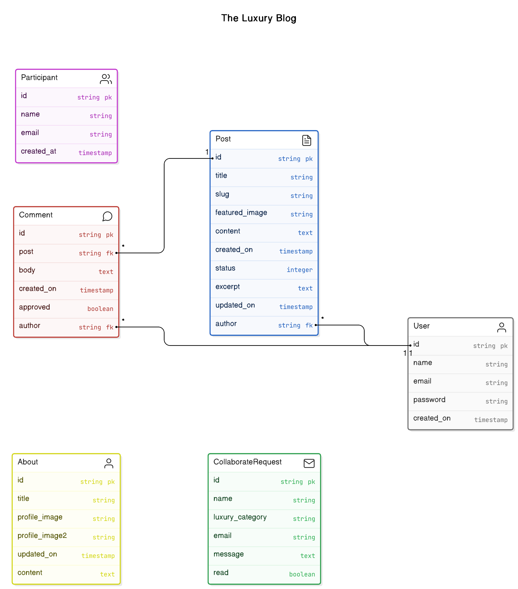
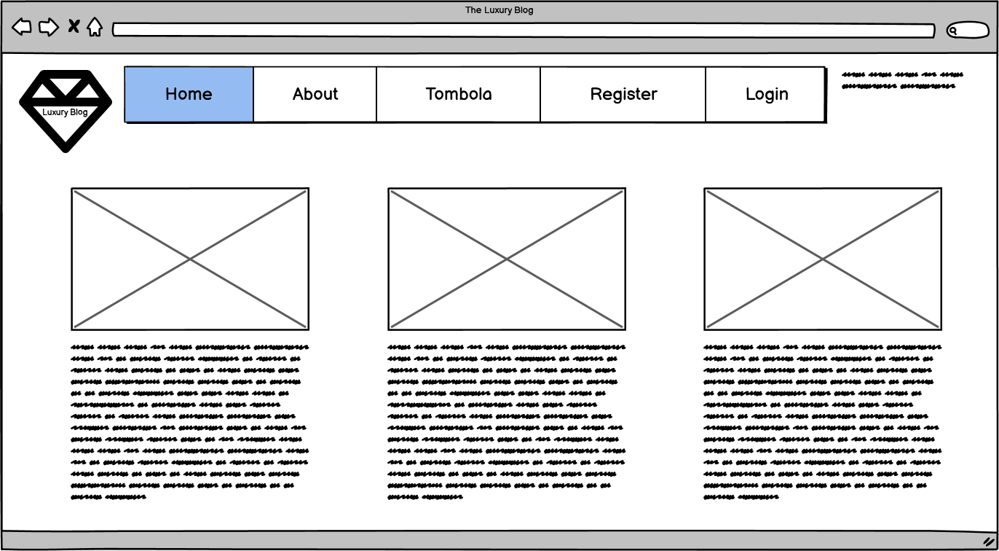
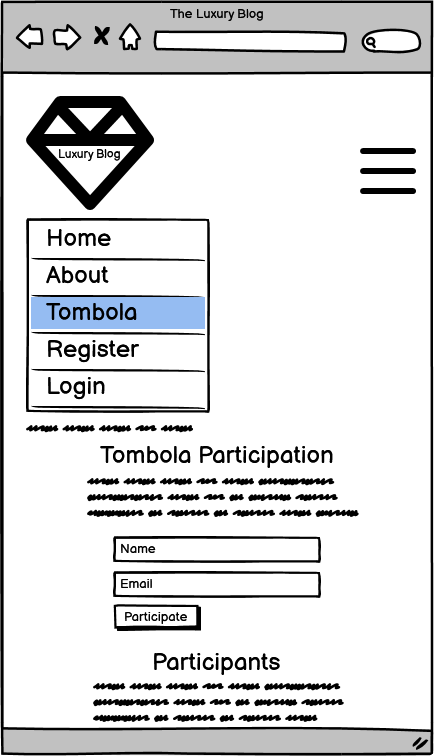
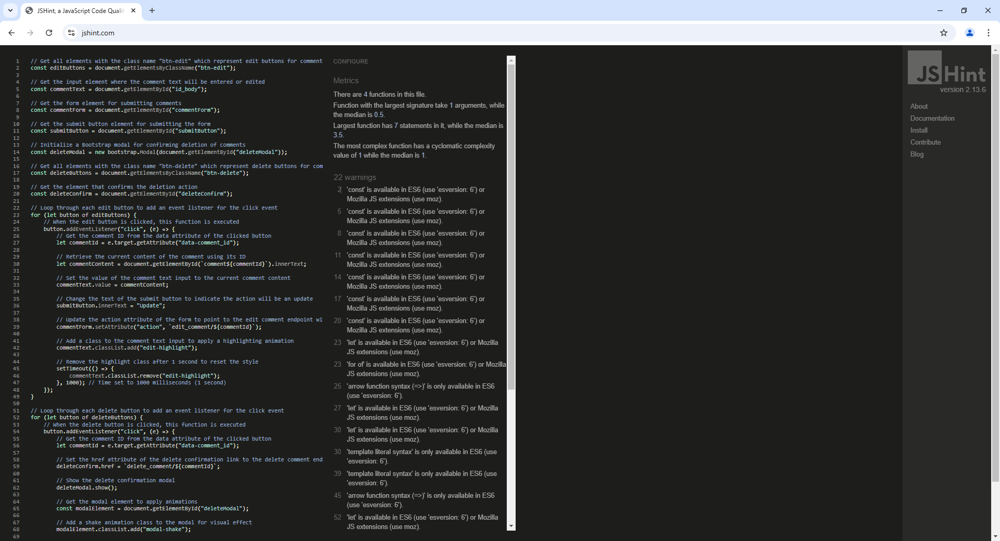

# The Luxury Blog
Portfolio Project 4: Full-Stack Toolkit - Code Institute

**Disclaimer: This fictional project is intended solely for educational purposes and is not suitable for practical real-world usage other than academic assessment.**

View the deployed site at [https://the-luxury-blog.onrender.com/](https://the-luxury-blog.onrender.com/)

Important: Please note that Render.com has a feature that automatically pauses services when they are not in active use. As a result, it may take about a minute for the site to load.

## Introduction

Welcome to Luxury Blog, a premier platform dedicated to curating a sophisticated and aspirational lifestyle for discerning readers. Our mission is to promote high-end goods through engaging content that resonates with affluent audiences, featuring in-depth product reviews that highlight craftsmanship and exclusivity, interviews with industry insiders for insights into the luxury sector, and exclusive brand partnerships showcasing the latest trends. We emphasize the prestige and unique qualities of luxury products—whether fashion items, automobiles, or travel experiences—through visually stunning imagery and compelling storytelling that foster a desire for ownership. Catering to an audience that appreciates elegance and sophistication, Luxury Blog strives to connect personal identities with the prestige of luxury goods, making each visit an enriching experience. Join us on this journey to explore the world of luxury!


## Agile Methodology

This project was planned using Agile project management through Epics, Descriptions, User Stories, Story Points, MoSCoW prioritization, Acceptance Criteria, and Tasks.

A Kanban board has been set up and used for this purpose, providing an organized overview. It can be accessed at: [https://github.com/users/linobollansee/projects/6](https://github.com/users/linobollansee/projects/6)

A screenshot of The Luxury Blog Kanban Board during active development phase usage:


### Epics

Epic 1: Plan and Design the Full-Stack Web Application using an MVC Framework
- Description: This epic focuses on planning and designing the Full-Stack application, ensuring adherence to Agile methodology, UX principles, and accessible design.
  - User Stories:
    - User Story 1.1: Design Front-End for a Data-Driven Web Application
    - User Story 1.2: Plan Agile Development Using an Agile Tool
    - User Story 1.3: Ensure Code Quality Standards

Epic 2: Implement Data Model and Application Features
- Description: This epic focuses on building the core application features, including database models, CRUD functionality, and business logic.
  - User Stories:
    - User Story 2.1: Build the Data Model and Database Structure
    - User Story 2.2: Implement CRUD Functionality
    - User Story 2.3: Handle Notifications for Data Changes

Epic 3: Authentication and Authorization
- Description: This epic addresses user authentication and permissions for accessing the application.
  - User Stories:
    - User Story 3.1: Implement Role-Based Authentication
    - User Story 3.2: Secure Restricted Content

Epic 4: Testing the Full-Stack Web Application
- Description: This epic focuses on ensuring that the application is thoroughly tested, both manually and automatically.
  - User Stories:
    - User Story 4.1: Implement Manual and Automated Tests

Epic 5: Version Control and Documentation
- Description: This epic ensures proper version control using Git, and documentation for the codebase and repository.
  - User Stories:
    - User Story 5.1: Maintain Version Control with Git
    - User Story 5.2: Document the Development Process

Epic 6: Deploy Application to Cloud
- Description: This epic covers deploying the application to a cloud platform and ensuring the final version is secure and matches the development version.
  - User Stories:
    - User Story 6.1: Deploy the Application to a Cloud Platform
    
Epic 7: Apply Object-Oriented Principles
- Description: This epic focuses on the use of object-oriented programming concepts within the project.
  - User Stories:
    - User Story 7.1: Design Efficient Models Using OOP

Epic 8: Enhance User Experience with Advanced Features
- Description: This epic focuses on delivering extra features to improve the overall experience for the users, including social sharing, customizable UI, and advanced filtering, beyond the basic project requirements.
  - User Stories:
    - User Story 8.1: Enable Social Media Sharing for User Content
    - User Story 8.2: Customize Dashboard Layout
    - User Story 8.3: Advanced Filtering and Search Options
    - User Story 8.4: Multi-Language Support

### User Stories

Please read this section thoroughly, as it includes important and comprehensive information on how the User Stories and their Tasks were accomplished for this project.

User Story 1.1: Design Front-End for a Data-Driven Web Application (Must Have, Story Points: 5)
- Description: As a user, I want a user-friendly front-end that follows accessibility guidelines and UX principles so that I can easily interact with the application.
  - Acceptance Criteria:
    - Front-end meets UX and accessibility guidelines.
    - Wireframes, mockups, and diagrams are documented.
  - Tasks:
    - Create wireframes and mockups for the front-end design.
    - Design HTML templates with consistent structure.
    - Implement CSS for responsive design.
    - Review and validate the front-end design against accessibility standards.
  - How Tasks were respectively completed:
    - Balsamiq software was used to create the wireframes, and web browser screenshots were taken for the mockups.
    - The  tag was used to create a consistent structure throughout the Django templates by inheriting the base layout.
    - The Bootstrap Framework with predefined grid classes with built-in responsive design was used to implement CSS for responsive design.
    - Google Lighthouse was utilized to assess and verify the front-end design's compliance with accessibility standards.

User Story 1.2: Plan Agile Development Using an Agile Tool (Must Have, Story Points: 8)
- Description: As a developer, I want to plan and track all tasks and user stories in an Agile tool so that I can manage the project efficiently.
  - Acceptance Criteria:
    - All user stories, epics, and tasks documented in the Agile tool.
  - Tasks:
    - Set up an Agile tool for task tracking.
    - Document all user stories, epics, and tasks in the tool.
    - Create a project board with priorities.
  - How Tasks were respectively completed:
    - A new GitHub project was started to be used as an Agile tool.
    - GitHub project issues were created to document user stories, epics, and tasks.
    - GitHub project labels with MoSCoW criteria were applied to create a project board with priorities.

User Story 1.3: Ensure Code Quality Standards (Must Have, Story Points: 3)
- Description: As a developer, I want the code to conform to PEP8 and validated HTML/CSS/Javascript standards so that the application maintains high-quality and consistent coding practices.
  - Acceptance Criteria:
    - Python code conforms to PEP8 standards.
    - HTML, CSS, Javascript code are validated.
  - Tasks:
    - Implement a code review process.
    - Use tools for Python, HTML, CSS, Javascript validation.
  - How Tasks were respectively completed:
    - The list of files to be checked was prepared, including all `*.html`, `*.css`, `*.js`, `*.py` files essential to this project.
    - Python code was checked with the Code Institute linter, HTML with the W3C Markup Validation Service, CSS with The W3C CSS Validation Service, Javascript with the JSHint JavaScript Code Quality Tool.

User Story 2.1: Build the Data Model and Database Structure (Must Have, Story Points: 5)
- Description: As a developer, I want to implement a database model that supports the application’s business logic and data manipulation needs.
  - Acceptance Criteria:
    - A well-structured data model exists for storing and retrieving data.
    - At least one custom model is implemented.
  - Tasks:
    - Design a database schema that fits the project domain.
    - Implement the database model.
    - Create migrations to initialize the database structure.
  - How Tasks were respectively completed:
    - An Entity-Relationship Diagram (ERD) was created to design a database schema that fits the project domain.
    - Database models were implemented through `models.py` files with field declarations in app folders.
    - Running the following commands in the terminal: `python manage.py makemigrations` and `python manage.py migrate` initialized the database structure. It executes the SQL commands through the migration files.

User Story 2.2: Implement CRUD Functionality (Must Have, Story Points: 5)
- Description: As a user, I want to create, update, read, and delete data so that I can manage my information within the application.
  - Acceptance Criteria:
    - All CRUD actions are functional.
    - Data changes are immediately reflected in the UI.
  - Tasks:
    - Build the back-end logic for CRUD operations.
    - Design forms for data input with validation.
    - Ensure changes to data are reflected on the front-end.
  - How Tasks were respectively completed:
    - Designing the back-end logic for CRUD operations involved defining `models.py` files to represent data structures, creating `views.py` files to handle the logic for displaying and processing data, `forms.py` for user input validation, setting up `urls.py` files to map requests to the appropriate views, and creating templates to render the HTML presentation.
    - The forms.py files were created and include a Meta class with attributes designed to validate data input.
    - The deployed website at [https://the-luxury-blog.onrender.com/](https://the-luxury-blog.onrender.com/) was actively verified to ensure changes to data were reflected on the front-end.

User Story 2.3: Handle Notifications for Data Changes (Must Have, Story Points: 3)
- Description: As a user, I want to receive notifications when data is added, updated, or deleted so that I’m informed about changes.
  - Acceptance Criteria:
    - Notifications are displayed to the user after data changes.
  - Tasks:
    - Implement a notification system for CRUD actions.
    - Test notifications with each operation.
  - How Tasks were respectively completed:
    - The notification system was based on views files importing `from django.contrib import messages` and using its constants for browser feedback.
    - The web browser was used to check for message notifications on each operation.

User Story 3.1: Implement Role-Based Authentication (Must Have, Story Points: 3)
- Description: As a user, I want to log in with role-based permissions so that I can access the appropriate content and features based on my role.
  - Acceptance Criteria:
    - Role-based authentication is implemented.
    - Users can register and log in.
  - Tasks:
    - Implement user registration and login functionality.
    - Apply role-based access controls to different features.
  - How Tasks were respectively completed:
    - The package `django-allauth` and its templates were used for handling authentication, registration, and account management. 
    - Role-based access controls to different features were implemented through template tags: `` and the `django-allauth` framework.

User Story 3.2: Secure Restricted Content (Must Have, Story Points: 3)
- Description: As a user, I should not be able to access restricted content before logging in.
  - Acceptance Criteria:
    - Restricted pages are inaccessible to unauthorized users.
  - Tasks:
    - Implement access control for restricted pages.
    - Test to ensure unauthorized users are redirected to login.
  - How Tasks were respectively completed:
    - The blog checks if the user is logged-in with the DTL tag `` and if not, renders different content below the  tag.
    - Visiting a blog post while not logged in displays "Log in to leave a comment"

User Story 4.1: Implement Manual and Automated Tests (Should Have, Story Points: 5)
- Description: As a developer, I want to create test procedures for both front-end and back-end components to ensure the application functions correctly.
  - Acceptance Criteria:
    - Automated and manual tests for core functionality are in place.
  - Tasks:
    - Write unit tests for Python back-end code.
    - Test CRUD operations, authentication, and data manipulation.
    - Document all testing procedures in the README.
  - How Tasks were respectively completed:
    - Test files were written for the back-end code containing unit tests: `test_apps.py`, `test_forms.py`, `test_models.py`, `test_urls.py`, `test_views.py`
    - Live interaction on [https://the-luxury-blog.onrender.com/] allowed to test CRUD operations, authentication, and data manipulation. The superuser admin panel showed the condition of the database.
    - Testing procedures were documented in the README.

User Story 5.1: Maintain Version Control with Git (Must Have, Story Points: 3)
- Description: As a developer, I want to use Git for version control so that I can document and manage changes in the codebase.
  - Acceptance Criteria:
    - Version control is implemented using Git and GitHub.
    - Descriptive commit messages are present.
  - Tasks:
    - Initialize a Git repository.
    - Commit changes for each feature or fix with detailed messages.
    - Ensure the repository is clean of security-sensitive information.
  - How Tasks were respectively completed:
    - A new repository was created by using the Code Institute's Public template: [https://github.com/Code-Institute-Org/ci-full-template](https://github.com/Code-Institute-Org/ci-full-template)
    - Features and changes were commmited with sufficiently detailed messages of a maximum of 50 characters.
    - All environmental variables were stored in `env.py` and added to the `.gitignore` list so they wouldn't be accidently committed and pushed to GitHub.

User Story 5.2: Document the Development Process (Must Have, Story Points: 8)
- Description: As a developer, I want to document the development process in a README so that others can understand how the project was built and used.
  - Acceptance Criteria:
     - README file includes project rationale, data schema, and testing/deployment instructions.
  - Tasks:
     - Write a README file with sections for rationale, setup, and testing.
     - Ensure deployment and usage instructions are clear.
  - How Tasks were respectively completed:
     - A README file was created in the project's root directory with many sections discussing rationale, setup, and testing.
     - Clear deployment instructions are written in the README file, and the live project link made available at the top of the README.

User Story 6.1: Deploy the Application to a Cloud Platform (Must Have, Story Points: 3)
- Description: As a developer, I want to deploy the final version of the application to a cloud platform so that it is accessible online.
  - Acceptance Criteria:
    - Application is deployed and functions correctly on the cloud platform.
    - No sensitive data in the repository.
  - Tasks:
    - Configure cloud platform.
    - Deploy the application.
    - Test the deployed application.
  - How Tasks were respectively completed:
    - An account was created on [https://render.com/](https://render.com/), a new Web Service created, and its start command, environment variables, etc. configured.
    - Deploy Web Service was clicked to deploy the application.
    - The dashboard was used to retrieve the live link which was opened to test the deployed application.

User Story 7.1: Design Efficient Models Using OOP (Must Have, Story Points: 5)
- Description: As a developer, I want to design a custom data model using OOP principles to efficiently manage data.
  - Acceptance Criteria:
    - Data model is designed using OOP principles.
  - Tasks:
    - Implement data model classes with relevant methods.
    - Refactor code to adhere to OOP principles.
  - How Tasks were respectively completed:
    - Models files were expanded through consultation of Django's Model field reference available at [https://docs.djangoproject.com/en/5.1/ref/models/fields/](https://docs.djangoproject.com/en/5.1/ref/models/fields/)
    - Object-oriented code was adjusted with OOP principles enforced by the Django framework.

User Story 8.1: Enable Social Media Sharing for User Content (Won't Have, Story points: 2)
- Description: As a user, I want to share my content or data from the application directly to social media platforms so that I can easily promote and share my work with others.
  - Acceptance Criteria:
    - Users can share content to platforms like Facebook, Twitter, and LinkedIn.
    - Social media buttons are integrated and functional for relevant content.
  - Tasks:
    - Add social media sharing buttons to key areas (e.g., profile, content pages).
    - Implement OAuth or API connections for social media sharing.
    - Test sharing functionality on different social platforms.
   - How Tasks were respectively completed:
    - Not completed.

User Story 8.2: Customize Dashboard Layout (Won't Have, Story points: 2)
- Description: As a user, I want to customize the layout of my dashboard so that I can organize the information in a way that suits my preferences.
  - Acceptance Criteria:
    - Users can drag and drop widgets or rearrange sections of their dashboard.
    - User preferences for the dashboard layout are saved and persist across sessions.
  - Tasks:
    - Implement a customizable dashboard with draggable components.
    - Store layout preferences in user profiles or local storage.
    - Test the persistence and functionality of customized layouts across devices.
  - How Tasks were respectively completed:
    - Not completed.

User Story 8.3: Advanced Filtering and Search Options (Won't Have, Story points: 2)
- Description: As a user, I want to filter and search through data using advanced options like keyword search, date range filters, and category-based sorting so that I can quickly find relevant information.
  - Acceptance Criteria:
    - Users can filter and sort data based on multiple parameters (e.g., keywords, categories, dates).
    - Search results are displayed in real-time as the user types.
  - Tasks:
    - Implement filtering and sorting logic on the back-end.
    - Add real-time search functionality with auto-suggestions.
    - Test advanced filtering and ensure it works seamlessly with large datasets.
  - How Tasks were respectively completed:
    - Not completed.

User Story 8.4: Multi-Language Support
- Description: As a user, I want to use the application in my preferred language so that I can interact with it in a language I’m comfortable with.
  - Acceptance Criteria:
    - Application is available in at least two languages.
    - Users can easily switch between languages from a settings menu.
  - Tasks:
    - Implement language selection functionality.
    - Translate all user-facing content and labels into the chosen languages.
    - Ensure proper formatting and layout for different languages (e.g., text direction).
  - How Tasks were respectively completed:
    - Not implemented, but considered partially in progress due to `` internationalization and `` translation tags being present in some of the project templates: `signup.html`, `login.html`, `logout.html`.

## Database

### Entity Relationship Diagram (ERD)



The syntax used on [https://app.eraser.io/](https://app.eraser.io/) to generate the diagram was as follows:

```
// Tables
About [icon: user, color: yellow] {
  id string pk
  title string
  profile_image string
  profile_image2 string
  updated_on timestamp
  content text
}

CollaborateRequest [icon: mail, color: green] {
  id string pk
  name string
  luxury_category string
  email string
  message text
  read boolean
}

Post [icon: file-text, color: blue] {
  id string pk
  title string
  slug string
  author string fk
  featured_image string
  content text
  created_on timestamp
  status integer
  excerpt text
  updated_on timestamp
}

Comment [icon: message-circle, color: red] {
  id string pk
  post string fk
  author string fk
  body text
  created_on timestamp
  approved boolean
}

Participant [icon: users, color: purple] {
  id string pk
  name string
  email string
  created_at timestamp
}

User [icon: user, color: gray] {
  id string pk
  name string
  email string
  password string
  created_on timestamp
}

// End of tables
title The Luxury Blog

// Relationships
Post.author > User.id
Comment.post > Post.id
Comment.author > User.id
```

## Design

### Wireframes

Balsamiq Wireframes, a powerful and user-friendly tool, was used to create a series of detailed wireframes that played a role in shaping the design and functionality of the web application, Luxury Blog. These wireframes serve as visual blueprints, allowing to map out the layout and structure of the website, ensuring that each component, from navigation menus to content, is thoughtfully arranged to enhance user experience and engagement.

Desktop computer wireframes:




Mobile device wireframes:





### Logo

The logo was made by CSS styling:

```
.luxury {
font-family: 'Great Vibes', cursive;
font-size: 64px;
color: #D4AF37; /* Gold color */
text-shadow: 2px 2px 5px rgba(0, 0, 0, 0.2);
display: block;
line-height: 0.9;
}
```

### Favicon

The favicon was generated using [https://favicon.io/favicon-generator/](https://favicon.io/favicon-generator/)


## Bugs and Issues

- Addressing HTML validation issues on the Sign-Up page at [https://the-luxury-blog.onrender.com/accounts/signup/](https://the-luxury-blog.onrender.com/accounts/signup/) presented significant challenges. Despite numerous discussions with the Code Institute to identify the root cause, a definitive solution proved elusive. After trying an experimental fix recommended by the Code Institute—visible in this commit: [https://github.com/linobollansee/the-luxury-blog/commit/16401e24a2478c976456b548f03e15709a8a4e3e](https://github.com/linobollansee/the-luxury-blog/commit/16401e24a2478c976456b548f03e15709a8a4e3e) the outcome was a complete failure to render the page, leading to a decision to revert back to the original walkthrough project code at [https://github.com/linobollansee/the-luxury-blog/commit/a49cfbaefbf159b29da800bc2dd25e9b03ff4171](https://github.com/linobollansee/the-luxury-blog/commit/a49cfbaefbf159b29da800bc2dd25e9b03ff4171), which still displays the same validation errors. However, I have been assured that these HTML errors will not affect project assessment results, as they may arise from external libraries and technologies beyond our control. Many more commit experiments were undertaken in an effort to try to understand the issue better, but with no real success. Finally, it was discovered that other students, even those graded with a distinction grade for their unrelated project, had the exact same issue. Filip Van Elslande's Astroblog errors can be seen at [https://validator.w3.org/nu/?doc=https%3A%2F%2Fastroshare-blog-6a7ca9d34749.herokuapp.com%2Fmembers%2Fregister%2F](https://validator.w3.org/nu/?doc=https%3A%2F%2Fastroshare-blog-6a7ca9d34749.herokuapp.com%2Fmembers%2Fregister%2F) for confirmation.

Luxury Blog HTML Errors:


- Single backticks, `&nbsp;` non-breaking spaces, and `<br>` line breaks were excessively used to create the README file. When I remembered that triple backticks were also supported and would implement similar functionality automatically, I upgraded all the content that would benefit from it.

## Technologies Used

### Languages

- HTML5: The latest version of the Hypertext Markup Language, used for structuring and presenting content on the web. It introduces new semantic elements (like `<article>`, `<section>`, and `<header>`) to improve document structure, supports multimedia elements (like `<audio>` and `<video>`), and provides APIs for enhanced functionality, such as local storage and geolocation.

- CSS: Cascading Style Sheets is a stylesheet language used to describe the presentation of a document written in HTML or XML. CSS controls layout, colors, fonts, and overall visual appearance. It enables responsive design techniques, allowing websites to adapt to different screen sizes and devices.

- JavaScript: A high-level, dynamic programming language primarily used for creating interactive and dynamic content on websites. It allows developers to implement complex features like animations, form validation, and asynchronous requests (AJAX). JavaScript runs in the browser, enabling real-time user interactions.

- Python: A versatile, high-level programming language known for its readability and simplicity. It supports multiple programming paradigms, including procedural, object-oriented, and functional programming. Python is widely used in web development, data analysis, artificial intelligence, and scientific computing due to its extensive libraries and frameworks.

- Markdown: Markdown is a lightweight markup language designed for formatting plain text. It allows users to create formatted documents using easy-to-read syntax, which can be converted to HTML. Markdown is popular for writing documentation, README files, and content on platforms like GitHub and blogs, due to its simplicity and readability.

### Frameworks

- Django: [https://www.djangoproject.com/](https://www.djangoproject.com/)

Django is a high-level Python web framework that encourages rapid development and clean, pragmatic design. It follows the Model-View-Template (MVT) architectural pattern and includes built-in features for security, database management, and user authentication. Django emphasizes the reusability of components, allowing developers to build scalable and maintainable web applications quickly. With its robust ORM (Object-Relational Mapping) system, Django simplifies database interactions and supports multiple database backends. The framework is widely used for developing complex web applications and is known for its "batteries-included" philosophy, providing numerous built-in tools and features.

- Bootstrap: [https://getbootstrap.com/](https://getbootstrap.com/)

Bootstrap is a popular open-source front-end framework for developing responsive and mobile-first websites. It provides a collection of CSS and JavaScript components, such as grid systems, buttons, forms, and navigation bars, that streamline the web design process. Bootstrap is designed to be customizable and comes with a set of predefined styles, making it easier for developers to create visually appealing and consistent layouts. Its responsive design capabilities ensure that websites adapt seamlessly to various screen sizes and devices, enhancing user experience.

### Libraries and modules:

`asgiref==3.7.2`
ASGI (Asynchronous Server Gateway Interface) reference implementation. It provides utilities for building and maintaining asynchronous web applications in Python. This module is particularly useful for handling asynchronous protocols such as WebSockets and HTTP/2.

`cloudinary==1.36.0`
A cloud service for managing images and videos, Cloudinary offers comprehensive tools for image and video upload, storage, manipulation, optimization, and delivery. This SDK allows Python applications to easily interact with Cloudinary's REST API.

`crispy-bootstrap5==0.7`
An extension of Django Crispy Forms that enables Bootstrap 5 support. It helps in rendering forms in a more elegant and Bootstrap-friendly way, allowing for customizable layouts and styles while maintaining simplicity in form creation.

`dj-database-url==0.5.0`
A utility for Django that allows database configuration from a URL string. This is particularly useful for deploying applications on platforms like Heroku, where database URLs are often provided in the environment variables.

`dj3-cloudinary-storage==0.0.6`
A storage backend for Django that integrates with Cloudinary. It allows developers to easily upload and manage media files in their Django applications using Cloudinary as the storage provider.

`django==4.2.7`
The latest version of the Django web framework, which is a high-level Python framework that encourages rapid development and clean, pragmatic design. Django is known for its scalability and its robust features like ORM, admin interface, authentication, and security features.

`django-allauth==0.57.0`
A Django application for handling authentication, registration, and account management, including social authentication. It provides a comprehensive solution for user accounts and simplifies the process of integrating third-party login systems.

`django-crispy-forms==2.1`
A Django application that allows you to control the rendering behavior of forms in a more flexible and elegant way. It simplifies the creation of complex form layouts and integrates with various front-end frameworks like Bootstrap.

`django-summernote==0.8.20.0`
A Django app that integrates Summernote, a WYSIWYG (What You See Is What You Get) editor, allowing users to create rich text content within Django applications. This makes content editing more user-friendly and visually appealing.

`gunicorn==20.1.0`
A Python WSGI HTTP server for UNIX that serves web applications in a production environment. Gunicorn is lightweight and designed to handle many concurrent requests, making it a popular choice for deploying Django applications.

`oauthlib==3.2.2`
A generic, spec-compliant implementation of the OAuth request-signing logic for Python. This library can be used to create OAuth service providers and consumers, allowing for secure API access and authorization.

`psycopg2==2.9.6`
The most popular PostgreSQL database adapter for Python. Psycopg2 enables Python applications to connect to and interact with PostgreSQL databases, supporting advanced features like connection pooling and asynchronous operations.

`PyJWT==2.8.0`
A Python library for encoding and decoding JSON Web Tokens (JWT). It allows for easy creation and validation of tokens, making it suitable for implementing authentication and information exchange in web applications.

`python3-openid==3.2.0`
A library that implements the OpenID authentication protocol, allowing users to authenticate themselves across multiple sites without having to create separate accounts. It provides a simple way to integrate OpenID into web applications.

`requests-oauthlib==1.3.1`
An extension of the popular requests library that provides OAuth1 and OAuth2 support. This module simplifies the process of making authenticated API requests using the OAuth protocol.

`sqlparse==0.4.4`
A non-validating SQL parser for Python. It provides functionalities for parsing, formatting, and analyzing SQL statements, making it useful for database operations and migrations.

`urllib3==1.26.18`
A powerful, user-friendly HTTP library for Python that provides features like connection pooling, client-side SSL/TLS verification, and easy access to HTTP APIs. It is widely used in conjunction with the requests library.

`whitenoise==5.3.0`
A middleware for serving static files in a Django application. Whitenoise allows applications to serve static assets directly without needing a separate web server, simplifying deployment and reducing complexity.

## Testing

### Browser Compatibility
The testing phase employed a range of web browsers to ensure comprehensive coverage and functionality of the site. The following browsers were utilized during this process:

- Google Chrome Version 130.0.6723.70 (64-bit)
- Microsoft Edge Version 130.0.2849.52 (64-bit)
- Firefox Version 131.0.3 (64-bit)
- Opera Version 114.0.5282.115 (64-bit)

### Automated Testing

A comprehensive suite of Python files was created to thoroughly test various components of The Luxury Blog's tombola app. This suite includes the following test files, with functionality clearly commented with triple quote docstrings and hashtags:

- [https://github.com/linobollansee/the-luxury-blog/blob/main/tombola/test_apps.py](https://github.com/linobollansee/the-luxury-blog/blob/main/tombola/test_apps.py)
```python
# Import TestCase from Django's testing framework
from django.test import TestCase

# Import the Tombola application configuration
from .apps import TombolaAppConfig


class TombolaAppConfigTest(TestCase):
    """Test case for the Tombola application configuration."""

    def test_app_config(self):
        """Test that the application name is set correctly."""
        # Assert that the name of the application matches the expected value
        self.assertEqual(TombolaAppConfig.name, 'tombola')

    def test_default_auto_field(self):
        """Test that the default auto field is set correctly."""
        # Assert that the default_auto_field is set to BigAutoField
        self.assertEqual(
            TombolaAppConfig.default_auto_field,
            'django.db.models.BigAutoField'
        )
  ```

- [https://github.com/linobollansee/the-luxury-blog/blob/main/tombola/test_forms.py](https://github.com/linobollansee/the-luxury-blog/blob/main/tombola/test_forms.py)
```python
# Import necessary Django form functionalities.
from django import forms
# Import TestCase from Django's testing framework to create unit tests.
from django.test import TestCase
# Import the ParticipantForm from the local forms module for testing.

from .forms import ParticipantForm
# Import the Participant model from the local models module.
from .models import Participant


class ParticipantFormTest(TestCase):
    """Unit tests for the ParticipantForm, ensuring it behaves correctly
    with valid and invalid input data.
    """

    def test_form_valid_data(self):
        """Test the form's behavior when provided with valid data."""
        # Define a dictionary with valid participant information, including
        # name and email fields.
        form_data = {
            'name': 'John Doe',
            'email': 'john.doe@example.com'
        }
        # Create an instance of ParticipantForm with the valid data.
        form = ParticipantForm(data=form_data)
        # Assert that the form is valid as the provided data meets all
        # the requirements.
        self.assertTrue(form.is_valid())
        # Verify that the cleaned data for 'name' matches the input data.
        self.assertEqual(form.cleaned_data['name'], 'John Doe')
        # Verify that the cleaned data for 'email' matches the input data.
        self.assertEqual(form.cleaned_data['email'],
                         'john.doe@example.com')

    def test_form_invalid_data_missing_name(self):
        """Test the form's behavior when the 'name' field is missing."""
        # Define form data that only includes an email, omitting the name.
        form_data = {
            'email': 'john.doe@example.com'
        }
        # Create an instance of ParticipantForm with the incomplete data.
        form = ParticipantForm(data=form_data)
        # Assert that the form is invalid because the 'name' field is required.
        self.assertFalse(form.is_valid())
        # Check if an error for the 'name' field is present in the form's
        # errors dictionary.
        self.assertIn('name', form.errors)
        # Assert that the error message indicates that the field is required.
        self.assertEqual(form.errors['name'], ['This field is required.'])

    def test_form_invalid_data_missing_email(self):
        """Test the form's behavior when the 'email' field is missing."""
        # Define form data that only includes a name, omitting the email.
        form_data = {
            'name': 'John Doe'
        }
        # Create an instance of ParticipantForm with the incomplete data.
        form = ParticipantForm(data=form_data)
        # Assert that the form is invalid because 'email' field is required.
        self.assertFalse(form.is_valid())
        # Check if an error for the 'email' field is present in the form's
        # errors dictionary.
        self.assertIn('email', form.errors)
        # Assert that the error message indicates that the field is required.
        self.assertEqual(form.errors['email'], ['This field is required.'])

    def test_form_invalid_email_format(self):
        """Test the form's behavior when an invalid email format is provided"""
        # Define form data that includes an invalid email format.
        form_data = {
            'name': 'John Doe',
            'email': 'not-an-email'
        }
        # Create an instance of ParticipantForm with the invalid email.
        form = ParticipantForm(data=form_data)
        # Assert that the form is invalid due to the incorrect email format.
        self.assertFalse(form.is_valid())
        # Check if an error for the 'email' field is present in the form's
        # errors dictionary.
        self.assertIn('email', form.errors)
        # Assert that the error message indicates the email format is invalid.
        self.assertEqual(form.errors['email'],
                         ['Enter a valid email address.'])

    def test_form_with_existing_email(self):
        """Test the form's behavior when an existing email is submitted."""
        # Create a participant with an email to test against existing entries.
        Participant.objects.create(name='Jane Doe',
                                   email='jane.doe@example.com')
        # Define form data that includes the existing email.
        form_data = {
            'name': 'John Doe',
            'email': 'jane.doe@example.com'  # same email as existing
        }
        # Create an instance of ParticipantForm with the data containing
        # the existing email.
        form = ParticipantForm(data=form_data)
        # Note: Add assertions to check the form's behavior regarding
        # duplicate emails as needed.

    def test_form_empty_data(self):
        """Test the form's behavior when no data is provided."""
        # Create an instance of ParticipantForm with empty data.
        form = ParticipantForm(data={})
        # Assert the form is invalid because both required fields are empty.
        self.assertFalse(form.is_valid())
        # Check if an error for the 'name' field is present in the form's
        # errors dictionary.
        self.assertIn('name', form.errors)
        # Check if an error for the 'email' field is present in the form's
        # errors dictionary.
        self.assertIn('email', form.errors)
```

- [https://github.com/linobollansee/the-luxury-blog/blob/main/tombola/test_models.py](https://github.com/linobollansee/the-luxury-blog/blob/main/tombola/test_models.py)
```python
# Import necessary modules and classes
from datetime import datetime  # Import datetime for date/time checks

from django.core.exceptions import ValidationError  # For validation errors
from django.db import IntegrityError  # For database integrity errors
from django.test import TestCase  # For creating test cases in Django

# Import the Participant model from the current application
from .models import Participant


class ParticipantModelTest(TestCase):
    """
    A test case class for testing the Participant model's functionality.

    This class inherits from Django's TestCase, providing methods for
    testing database models and their behavior.
    """

    def setUp(self):
        """
        Set up the test case environment before each test method runs.

        This method creates a sample Participant instance for use in
        multiple test methods.
        """
        self.participant = Participant.objects.create(
            name="John Doe",  # Set the name of the participant
            email="johndoe@example.com"  # Set the email of the participant
        )

    def test_participant_creation(self):
        """
        Test that a Participant instance is created correctly.

        This method checks if the attributes of the created Participant
        match the expected values.
        """
        # Assert that the name of the participant matches the expected value
        self.assertEqual(self.participant.name, "John Doe")
        # Assert that the email of the participant matches the expected value
        self.assertEqual(self.participant.email, "johndoe@example.com")
        # Check that the created_at field is a datetime instance
        self.assertIsInstance(self.participant.created_at, datetime)

    def test_string_representation(self):
        """
        Test the string representation of the Participant instance.

        This method checks if the string representation of the
        Participant instance returns the correct name.
        """
        # Assert that converting the participant to a string returns the name
        self.assertEqual(str(self.participant), "John Doe")

    def test_unique_email_constraint(self):
        """
        Test that email addresses for Participants are unique.

        This method verifies that attempting to create a second
        Participant with the same email raises an IntegrityError.
        """
        # Use a context manager to assert that IntegrityError is raised
        with self.assertRaises(IntegrityError):
            Participant.objects.create(
                name="Jane Doe",  # Create new participant with the same email
                email="johndoe@example.com"  # Same email
            )

    def test_max_length_name(self):
        """
        Test that the maximum length for the Participant's name is enforced.

        This method checks that trying to create a Participant with a
        name longer than the allowed maximum length raises a
        ValidationError.
        """
        # Create a string that exceeds the maximum length for the name
        max_length_name = 'a' * 101  # Assuming max length is 100
        # Use a context manager to assert that ValidationError is raised
        with self.assertRaises(ValidationError):
            # Create a participant with an excessively long name
            participant = Participant(
                name=max_length_name,
                email="test@example.com"
            )
            # Trigger model validation
            participant.full_clean()  # This will validate all fields

    def test_valid_email(self):
        """
        Test that an invalid email format raises a ValidationError.

        This method verifies that creating a Participant with an
        improperly formatted email address triggers a validation error.
        """
        # Use a context manager to assert that ValidationError is raised
        with self.assertRaises(ValidationError):
            # Create a participant with an invalid email format
            participant = Participant(
                name="Invalid Email",
                email="invalidemail.com"
            )
            # Trigger model validation
            participant.full_clean()  # This will check the email format
```

- [https://github.com/linobollansee/the-luxury-blog/blob/main/tombola/test_urls.py](https://github.com/linobollansee/the-luxury-blog/blob/main/tombola/test_urls.py)
```python
# Import necessary modules from Django
from django.test import SimpleTestCase  # Provides a way to create simple tests
from django.urls import reverse  # Allows us to reverse resolve URLs


# Define a test case class for URL testing, inheriting from SimpleTestCase
class UrlsTestCase(SimpleTestCase):

    # Define a test method to check the URL for the tombola view
    def test_tombola_url(self):
        """
        Test that the tombola URL resolves correctly to the tombola_view.

        This method checks if the URL associated with the name 'tombola' can
        be correctly resolved to the expected path. It ensures that the URL
        configuration is set up correctly in the Django project.
        """

        # Use Django's reverse function to get the URL for the tombola view
        url = reverse('tombola')

        # Assert that the resolved URL matches the expected URL pattern
        self.assertEqual(url, '/tombola/')
```

- [https://github.com/linobollansee/the-luxury-blog/blob/main/tombola/test_views.py](https://github.com/linobollansee/the-luxury-blog/blob/main/tombola/test_views.py)
```python
# Import necessary modules for testing
from django.contrib.messages import get_messages  # For testing messages
from django.test import TestCase  # Base class for creating test cases
from django.urls import reverse  # Utility for reversing URL patterns

from .forms import ParticipantForm  # Import the form used in the view
from .models import Participant  # Import the Participant model


class TombolaViewTests(TestCase):
    """
    Test suite for the Tombola view functionality.

    This class contains various test cases to ensure the Tombola view
    behaves as expected. It tests GET and POST requests, form validation,
    and pagination.
    """

    def setUp(self):
        """
        Set up the initial conditions for the test cases.

        This method is called before every test method to set up any state
        that's shared across tests. Here, we define the URL and valid
        participant data for testing.
        """
        # Define the URL for the tombola view using reverse lookup
        self.url = reverse('tombola')

        # Define valid participant data for testing the form
        self.participant_data = {
            'name': 'Test Participant',  # Valid name for the participant
            'email': 'test@example.com',  # Valid email address
            # Other required fields for the ParticipantForm can be added here
        }

    def test_tombola_view_get(self):
        """
        Test tombola view returns correct template and context on GET request.

        This test ensures that when the tombola view is accessed via a GET
        request, it returns the correct HTTP status code, template, and
        context variables.
        """
        # Simulate a GET request to the tombola view
        response = self.client.get(self.url)

        # Check that the response has a status code of 200 (OK)
        self.assertEqual(response.status_code, 200)

        # Ensure that the correct template is used for rendering the response
        self.assertTemplateUsed(response, 'tombola/tombola.html')

        # Verify that 'form' and 'participants' are included in the response
        self.assertIn('form', response.context)
        self.assertIn('participants', response.context)

        # Ensure the form in context is an instance of ParticipantForm
        self.assertIsInstance(response.context['form'], ParticipantForm)

    def test_tombola_view_post_valid(self):
        """
        Test tombola view processes valid form data correctly.

        This test checks that when valid participant data is posted to the
        tombola view, it processes the data correctly and creates a new
        participant.
        """
        # Simulate a POST request with valid participant data
        response = self.client.post(self.url, self.participant_data)

        # Check that the response redirects after successful submission
        self.assertEqual(response.status_code, 302)  # 302 means a redirect

        # Verify that a new participant has been created in the database
        self.assertEqual(Participant.objects.count(), 1)

        # Ensure that the created participant's name matches the expected name
        self.assertEqual(
            Participant.objects.first().name,
            'Test Participant'
        )

        # Check that a success message was added to the request
        messages = list(get_messages(response.wsgi_request))  # Retrieve msgs
        self.assertEqual(len(messages), 1)  # Ensure one message exists
        self.assertEqual(
            messages[0].message,
            'Your Tombola participation has been successfully registered!'
        )

    def test_tombola_view_post_invalid(self):
        """
        Test tombola view handles invalid form data correctly.

        This test ensures that when invalid data is submitted to the tombola
        view, it returns to the form without creating a new participant.
        """
        # Define invalid participant data (missing required name field)
        invalid_data = {
            'name': '',  # Invalid: name is required and cannot be empty
            'email': 'test@example.com',  # Valid email, but data is invalid
        }

        # Simulate a POST request with invalid participant data
        response = self.client.post(self.url, invalid_data)

        # Check that the response returns a status code of 200
        self.assertEqual(response.status_code, 200)

        # Verify that no new participants were created in the database
        self.assertEqual(Participant.objects.count(), 0)

    def test_tombola_view_pagination(self):
        """
        Test pagination works correctly in the tombola view.

        This test ensures that when there are more participants than can
        fit on one page, the pagination correctly displays the participants
        across multiple pages.
        """
        # Create 25 participant instances for testing pagination
        for i in range(25):
            Participant.objects.create(
                name=f'Participant {i}',
                email=f'participant{i}@example.com'
            )

        # Simulate a GET request to retrieve the second page of participants
        response = self.client.get(self.url + '?page=2')

        # Check that the response status is OK
        self.assertEqual(response.status_code, 200)

        # Verify that the response contains exactly 10 participants (per page)
        self.assertEqual(len(response.context['participants']), 10)

        # Ensure that the participants object is on the second page
        self.assertEqual(response.context['participants'].number, 2)
```

Existing tests from the walkthrough project were also updated due to added field content:

- [https://github.com/linobollansee/the-luxury-blog/blob/main/about/test_forms.py](https://github.com/linobollansee/the-luxury-blog/blob/main/about/test_forms.py)
```python
# Importing the TestCase class from Django's test framework,
# which provides tools for creating unit tests for Django applications.
from django.test import TestCase

# Importing the CollaborateForm class from the forms module.
from .forms import CollaborateForm

# Defining a test case class for the CollaborateForm.
# This class inherits from TestCase, allowing us to create tests for the form.


class TestCollaborateForm(TestCase):

    # Test method to check if the form is valid with all required fields.
    def test_form_is_valid(self):
        """Test for all fields to ensure the form is valid."""

        # Creating an instance of the CollaborateForm with valid data.
        form = CollaborateForm(
            {
                'name': 'test',  # Providing a name
                'luxury_category': 'Diamonds',  # Providing a luxury category
                'email': 'test@test.com',  # Providing a valid email address
                'message': 'Hello!'  # Providing a message
            }
        )

        # Asserting that the form is valid. If not, show an error message.
        self.assertTrue(form.is_valid(), msg="Form is not valid")

    # Test method to check if the 'name' field is required.
    def test_name_is_required(self):
        """Test for the 'name' field to ensure it is mandatory."""

        # Creating an instance of CollaborateForm with an empty 'name' field.
        form = CollaborateForm(
            {
                'name': '',  # Empty name field
                'luxury_category': 'Diamonds',  # Provide valid luxury category
                'email': 'test@test.com',  # Providing valid email address
                'message': 'Hello!'  # Providing a message
            }
        )

        # Asserting that the form is invalid because the name field is empty.
        self.assertFalse(
            form.is_valid(),
            msg="Name was not provided, but the form is valid"
        )

    # Test method to check if the 'luxury_category' field is required.
    def test_luxury_category_is_required(self):
        """Test for the 'luxury_category' field to ensure it is mandatory."""

        # Create an instance of CollaborateForm with empty 'luxury_category'.
        form = CollaborateForm(
            {
                'name': 'Matt',  # Provide a valid name
                'luxury_category': '',  # Empty luxury category
                'email': 'test@test.com',  # Provide a valid email address
                'message': 'Hello!'  # Provide a message
            }
        )

        # Asserting form is invalid because the luxury category field is empty.
        self.assertFalse(
            form.is_valid(),
            msg="Luxury category was not provided, but the form is valid"
        )

    # Test method to check if the 'email' field is required.
    def test_email_is_required(self):
        """Test for the 'email' field to ensure it is mandatory."""

        # Create instance of the CollaborateForm with an empty 'email' field.
        form = CollaborateForm(
            {
                'name': 'Matt',  # Provide a valid name
                'luxury_category': 'Diamonds',  # Provide valid luxury category
                'email': '',  # Empty email field
                'message': 'Hello!'  # Provide a message
            }
        )

        # Asserting that the form is invalid because the email field is empty.
        self.assertFalse(
            form.is_valid(),
            msg="Email was not provided, but the form is valid"
        )

    # Test method to check if the 'message' field is required.
    def test_message_is_required(self):
        """Test for the 'message' field to ensure it is mandatory."""

        # Create an instance of CollaborateForm with an empty 'message' field.
        form = CollaborateForm(
            {
                'name': 'Matt',  # Provide a valid name
                'luxury_category': 'Diamonds',  # Provide valid luxury category
                'email': 'test@test.com',  # Provide valid email address
                'message': ''  # Empty message field
            }
        )

        # Asserting the form is invalid because the message field is empty.
        self.assertFalse(
            form.is_valid(),
            msg="Message was not provided, but the form is valid"
        )
```

- [https://raw.githubusercontent.com/linobollansee/the-luxury-blog/refs/heads/main/about/test_views.py](https://raw.githubusercontent.com/linobollansee/the-luxury-blog/refs/heads/main/about/test_views.py)
```python
from django.test import TestCase  # Import TestCase to create test cases
from django.urls import reverse  # Import reverse to generate URLs by own name
# Import About model to interact with about content in the test
from .models import About
# Import CollaborateForm to verify form existence in the view context
from .forms import CollaborateForm


class TestAboutView(TestCase):
    """Test case for the 'About' view"""

    def setUp(self):
        """Sets up initial test data for the About view."""
        # Create an instance of About model with sample 'About Me' content
        self.about_content = About(
            title="About Me", content="This is about me.")
        self.about_content.save()  # Save the instance to the test database

    def test_render_about_page_with_collaborate_form(self):
        """Tests rendering of the About page, checking for a form."""
        # Simulate a GET request to the 'about' URL
        response = self.client.get(reverse('about'))

        # Verify the response status is 200 (successful)
        self.assertEqual(response.status_code, 200)

        # Check if the content 'About Me' is present in the response
        self.assertIn(b'About Me', response.content)

        # Verify 'collaborate_form' is an instance of CollaborateForm
        self.assertIsInstance(
            response.context['collaborate_form'], CollaborateForm)

    def test_successful_collaboration_request_submission(self):
        """Tests submission of a collaboration request via POST."""
        # Define POST data to simulate a form submission
        post_data = {
            'name': 'test name',
            'luxury_category': 'Diamonds',
            'email': 'test@test.com',
            'message': 'test message'
        }

        # Simulate a POST request to the 'about' URL with the post_data
        response = self.client.post(reverse('about'), post_data)

        # Verify the response status is 200 (successful)
        self.assertEqual(response.status_code, 200)

        # Check if a success message is in the response content
        self.assertIn(
            b'Form received! Thank you for your interest.', response.content)
```

Blog automated tests were kept the same on purpose, to always have working components to refer back to during development. They were however commented for enhanced clarity:

- [https://raw.githubusercontent.com/linobollansee/the-luxury-blog/refs/heads/main/blog/test_forms.py](https://raw.githubusercontent.com/linobollansee/the-luxury-blog/refs/heads/main/blog/test_forms.py)
```python
from django.test import TestCase  # Import TestCase class for writing tests
from .forms import CommentForm  # Import the CommentForm from current package


class TestCommentForm(TestCase):
    # A test case class for testing the CommentForm functionality

    def test_form_is_valid(self):
        # Test that the form is valid when a valid body is provided
        # Create a CommentForm instance with a valid body
        comment_form = CommentForm({'body': 'This is a great post'})
        # Check that the form is valid and assert if it's not
        self.assertTrue(comment_form.is_valid(), msg="Form is invalid")

    def test_form_is_invalid(self):
        # Test that the form is invalid when no body is provided
        # Create a CommentForm instance with an empty body
        comment_form = CommentForm({'body': ''})
        # Check that the form is invalid and assert if it is
        self.assertFalse(comment_form.is_valid(), msg="Form is valid")
```

- [https://raw.githubusercontent.com/linobollansee/the-luxury-blog/refs/heads/main/blog/test_views.py](https://raw.githubusercontent.com/linobollansee/the-luxury-blog/refs/heads/main/blog/test_views.py)
```python
from django.test import TestCase  # Import Django's test framework
# Import the User model for authentication
from django.contrib.auth.models import User
from django.urls import reverse  # Import reverse to resolve URLs by name
from .forms import CommentForm  # Import the CommentForm for testing
from .models import Post  # Import the Post model


class TestBlogViews(TestCase):
    """Unit tests for blog views"""

    def setUp(self):
        """Set up test data: create a superuser and a sample blog post"""
        # Create a superuser for testing
        self.user = User.objects.create_superuser(
            username="myUsername", password="myPassword",
            email="test@test.com")
        # Create a sample blog post linked to the superuser
        self.post = Post(title="Blog title", author=self.user,
                         slug="blog-title", excerpt="Blog excerpt",
                         content="Blog content", status=1)
        self.post.save()  # Save the blog post to the test database

    def test_render_post_detail_page_with_comment_form(self):
        """Verify the post detail page renders correctly with a comment form"""
        # Get the detail page for the created blog post
        response = self.client.get(reverse('post_detail', args=['blog-title']))
        # Check if the page returns a status code of 200 (OK)
        self.assertEqual(response.status_code, 200)
        # Verify that the post title and content are present in the response
        self.assertIn(b"Blog title", response.content)
        self.assertIn(b"Blog content", response.content)
        # Confirm that the page includes an instance of the CommentForm
        self.assertIsInstance(response.context['comment_form'], CommentForm)

    def test_successful_comment_submission(self):
        """Test posting a comment to a post"""
        # Log in the superuser to simulate an authenticated request
        self.client.login(username="myUsername", password="myPassword")
        # Define the post data for a comment submission
        post_data = {
            'body': 'This is a test comment.'
        }
        # Post the comment data to the post detail page
        response = self.client.post(
            reverse('post_detail', args=['blog-title']), post_data)
        # Ensure the response status code is 200 (OK)
        self.assertEqual(response.status_code, 200)
        # Check for a success message confirming comment submission
        self.assertIn(b'Comment submitted and awaiting approval',
                      response.content)
```

Running the automated tests in the IDE Terminal:


### Python PEP 8

All the project and app Python files listed below were checked with the Code Institute Python Linter at [https://pep8ci.herokuapp.com/](https://pep8ci.herokuapp.com/)
and none contained PEP 8 errors except for `luxury/settings.py` As the errors are pregenerated code, and the PEP 8 guidelines make an exception for extremely long imports, the file did not have to be corrected.

```plaintext
about/__init__.py
about/admin.py
about/apps.py
about/forms.py
about/models.py
about/test_forms.py
about/test_views.py
about/tests.py
about/urls.py
about/views.py

blog/__init__.py
blog/admin.py
blog/apps.py
blog/forms.py
blog/models.py
blog/test_forms.py
blog/test_views.py
blog/tests.py
blog/urls.py
blog/views.py

luxury/__init__.py
luxury/asgi.py
luxury/settings.py
luxury/urls.py
luxury/wsgi.py

tombola/__init__.py
tombola/admin.py
tombola/apps.py
tombola/forms.py
tombola/models.py
tombola/test_apps.py
tombola/test_forms.py
tombola/test_models.py
tombola/test_urls.py
tombola/test_views.py
tombola/urls.py
tombola/views.py
```

The `tombola/models.py` file passing PEP 8 validation


The `luxury/settings.py` errors that do not break PEP 8 guidelines:


### HTML Validation

Django Template Language (DTL) constructs such as Template Tags (e.g., ), Template Variables (e.g., {{ variable }}), Custom Filters (e.g., {{ value|filter_name }}), Load Statements (e.g., ), Comment Syntax (e.g., {# This is a comment #}), Block Tags (e.g., ), and Extends Tags (e.g., ) cannot be validated by standard HTML validators. Therefore, it is necessary to validate the rendered pages instead.

Home

[https://validator.w3.org/nu/?doc=https%3A%2F%2Fthe-luxury-blog.onrender.com%2F](https://validator.w3.org/nu/?doc=https%3A%2F%2Fthe-luxury-blog.onrender.com%2F)

About

[https://validator.w3.org/nu/?doc=https%3A%2F%2Fthe-luxury-blog.onrender.com%2Fabout%2F](https://validator.w3.org/nu/?doc=https%3A%2F%2Fthe-luxury-blog.onrender.com%2Fabout%2F)

Tombola

[https://validator.w3.org/nu/?doc=https%3A%2F%2Fthe-luxury-blog.onrender.com%2Ftombola%2F](https://validator.w3.org/nu/?doc=https%3A%2F%2Fthe-luxury-blog.onrender.com%2Ftombola%2F
)

Important: The Sign Up page below contains HTML validation errors that were directly blamed on `allauth` by the Code Institute and not the fault or responsibility of the student. See the Bugs and Issues section for more detailed information.

Sign Up

[https://validator.w3.org/nu/?doc=https%3A%2F%2Fthe-luxury-blog.onrender.com%2Faccounts%2Fsignup%2F](https://validator.w3.org/nu/?doc=https%3A%2F%2Fthe-luxury-blog.onrender.com%2Faccounts%2Fsignup%2F)

Log in

[https://validator.w3.org/nu/?doc=https%3A%2F%2Fthe-luxury-blog.onrender.com%2Faccounts%2Flogin%2F](https://validator.w3.org/nu/?doc=https%3A%2F%2Fthe-luxury-blog.onrender.com%2Faccounts%2Flogin%2F)

Log out

[https://validator.w3.org/nu/?doc=https%3A%2F%2Fthe-luxury-blog.onrender.com%2Faccounts%2Flogout%2F](https://validator.w3.org/nu/?doc=https%3A%2F%2Fthe-luxury-blog.onrender.com%2Faccounts%2Flogout%2F)

### CSS Validation

The W3C CSS Validation Service at [https://jigsaw.w3.org/css-validator/](https://jigsaw.w3.org/css-validator/) validated the `style.css` file used in The Luxury Blog project without errors:


### Javascript Validation

JSHint, a JavaScript Code Quality Tool at [https://jshint.com/](https://jshint.com/) was used to validate the `static/js/comments.js` file used in the Luxury Blog project without errors:



## Deployment

### Render Web Application Deployment

1. Sign in at [https://render.com/](https://render.com/) using GitHub
2. Click the "New" button at the top of the page, click "Web Service"
3. Select the GitHub repository, click "Connect"
4. Verify Language is set to "Python3", Branch to "main", Region to "Frankfurt (EU Central)", build command to `pip install -r requirements.txt`
5. Set the start command to `gunicorn luxury.wsgi`
6. Select the Instance type: Free
7. Add the Environment Variables: CLOUDINARY_URL, DATABASE_URL, SECRET_KEY, and their corresponding values.
8. Click Deploy Web Service

### Cloudinary

1. Sign up at [https://cloudinary.com/](https://cloudinary.com/)
2. Login to your account
3. Click on dashboard, Go to API Keys
4. Use the API Key, API Secret, and displayed cloud name to create the environment variable in the following format: `CLOUDINARY_URL=cloudinary://<your_api_key>:<your_api_secret>@<cloud_name>`

### PostgreSQL Database

1. Input your email address at [https://dbs.ci-dbs.net/](https://dbs.ci-dbs.net/)
2. Open the email of the Code Institute bot, it contains the Postgres Database URL.
3. Alternatively, you can click on the email's database management link and on the info button of the Database name to get the Database URL.

## Credits

### Content

The images used in the Luxury Blog posts were sourced through online searches and manually resized to 800x530 in webp format to enhance loading speed:
  - [https://presse.mercedes-benz.at/Content/441067/55f35cb0-5d40-4f8b-b662-ff5d99f7c0bc/1200/2400/.jpg](https://presse.mercedes-benz.at/Content/441067/55f35cb0-5d40-4f8b-b662-ff5d99f7c0bc/1200/2400/.jpg)
  - [https://media.rolex.com/image/upload/q_auto:eco/f_auto/t_v7/c_limit,w_1920/v1/catalogue/2024/upright-c/m126618ln-0002](https://media.rolex.com/image/upload/q_auto:eco/f_auto/t_v7/c_limit,w_1920/v1/catalogue/2024/upright-c/m126618ln-0002)
  - [https://dsfantiquejewelry.com/cdn/shop/files/vintage-montblanc-meisterstuck-fountain-pen-602022.jpg?v=1711743082&width=1600](https://dsfantiquejewelry.com/cdn/shop/files/vintage-montblanc-meisterstuck-fountain-pen-602022.jpg?v=1711743082&width=1600)

### Code

- Gitpod Enterprise at [https://codeinstitute-ide.net/](https://codeinstitute-ide.net/) was the Integrated Development Environment (IDE) used for this project. This cloud-based IDE provided me with a powerful and versatile platform that allowed me to write, test, and debug my code seamlessly. With Gitpod Enterprise, I was able to set up my development environment quickly and efficiently, ensuring that I had all the necessary tools and configurations at my fingertips.
- ChatGPT at [https://chatgpt.com/](https://chatgpt.com/) was utilized to enhance my understanding of programming best practices, specifically for Python, by exploring a wide range of source code examples. This exploration aimed to identify the cleanest and most effective coding techniques that promote readability, maintainability, and efficiency within Python development. Through the analysis of these diverse examples, I gathered valuable insights into optimal coding standards and approaches tailored for Python. ChatGPT also aided with commenting part of my codebase and checking and improving my README.md write-up, by often giving me ideas for more precise wording.
- CI Python Linter at [https://pep8ci.herokuapp.com/](https://pep8ci.herokuapp.com/) was used for finding spacing and newline errors when making project Python files PEP8 compliant. This tool provides a straightforward interface to assess Python code against the PEP 8 style guide, which is crucial for maintaining readability and consistency in codebases. By utilizing this linter, developers can easily identify formatting issues that might otherwise go unnoticed, such as incorrect indentation, excessive whitespace, and missing or unnecessary newlines.
- The Code Institute repository at [https://github.com/Code-Institute-Solutions/blog](https://github.com/Code-Institute-Solutions/blog) provided a foundational starting point for my project. It contained essential code structures, examples, and best practices that guided the initial setup and implementation phases. Leveraging this codebase allowed me to focus on customizing and extending functionalities specific to my project's needs, rather than starting from scratch.

### Acknowledgments

- Code Institute mentors Dick Vlaanderen and Mo Shami: They clarified the project requirements during online audio call sessions, providing valuable insights and guidance that helped me understand the expectations and objectives more clearly. Their expertise was instrumental in navigating the complexities of the project I undertook. Additionally, they verified my work before submission to the Code Institute, offering constructive feedback that enabled me to enhance the quality of my submissions. Their support and mentorship not only bolstered my confidence but also significantly contributed to my growth as a developer.

- Code Institute student Filip Van Elslande: Our Django framework discussions and his insights and willingness to share his knowledge have greatly enhanced my understanding of the framework. Filip's enthusiasm for web development and collaborative spirit has made a significant impact on my learning experience, and I am grateful for his support. Filip's GitHub profile page is at [https://github.com/Harmonica-Men](https://github.com/Harmonica-Men)

- Code Institute student Dajana Isbaner: I actively assisted in correcting mistakes on Dajana Isbaner's PP4 repository to allow mutually beneficial learning throughout the process. The end result influenced my own project. Dajana's PP4 project is at [https://github.com/queenisabaer/wishlist](https://github.com/queenisabaer/wishlist) and her GithHub profile page is at: [https://github.com/queenisabaer](https://github.com/queenisabaer)

- Slack Community member Daisy Mc Girr: With close to a decade of experience in the tech industry, Daisy can provide information about developer culture and practices, which can help
with project time management. Daisy's GitHub profile page is at [https://github.com/Dee-McG](https://github.com/Dee-McG)

- Slack Community member Kelly Hutchison: Along with project discussions, gave me the motto: "Pass first, then play later" in order to succeed with PP4. Kelly's GitHub profile page is at [https://github.com/quiltingcode](https://github.com/quiltingcode)

### Project Advice

- When using a Kanban board, seeing a task marked as "Done" can give a sense of completion, but it shouldn't necessarily signal the end of refinement. Reassessing finished tasks, especially when there’s extra time or resources, can be invaluable. This approach not only allows for minor tweaks that improve functionality or visual polish but also supports continuous improvement principles. Optimizing user interactions, improving performance, or adding small but impactful features can elevate the project.